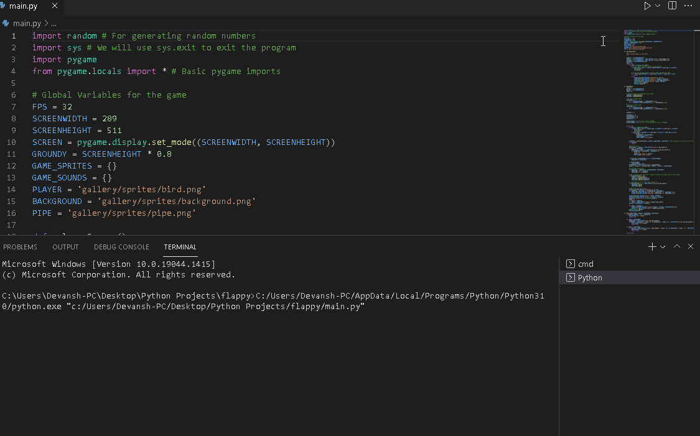

# Flappy-Bird-Python-GUI
Flappy Bird game using Pygame library

**Flappy Bird** is a python game which is a side-scroller where the player controls a bird, attempting to fly between columns of green pipes without hitting them.

Submitted by: **Devansh Goel**

Time spent: **7-9** hours spent in total

## User Stories

The following **required** functionality is completed:

* [x] User can **Add his own profile picture at the start**
* [x] User can **Bird by default tends to go down, pressing spacebar pushes it upwards (which is used to dodge obstacles)**
* [x] User can enjoy **The background music and different sounds on winning or crashing**
* [x] User can **safely exit the program and Scores are reflected on the top of the screen** 
* [x] I learnt **different techniques in Adobe Photoshop**
* [x] Installed **Flappy Bird Font** to make the program more stylish and natural looking.  

## Video Walkthrough

Here's a walkthrough of implemented user stories:

GIF created with [LiceCap](http://www.cockos.com/licecap/).

## Notes

It is better to use the Photomap Library to import images in the GUI program.

## License

    Copyright [2021] [Devansh]

    Licensed under the Apache License, Version 2.0 (the "License");
    you may not use this file except in compliance with the License.
    You may obtain a copy of the License at

        http://www.apache.org/licenses/LICENSE-2.0

    Unless required by applicable law or agreed to in writing, software
    distributed under the License is distributed on an "AS IS" BASIS,
    WITHOUT WARRANTIES OR CONDITIONS OF ANY KIND, either express or implied.
    See the License for the specific language governing permissions and
    limitations under the License.
